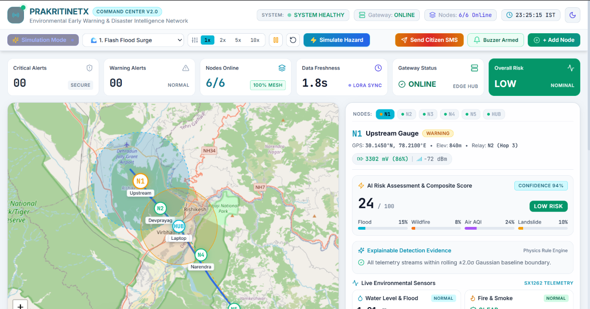

# PrakritiNetX

> **An Autonomous, AI-Accelerated Environmental Early Warning & Hydro-Meteorological Intelligence Network for Flash Floods, Forest Fires, and Landslide Precursors in Mountain River Basins.**

[](Hardware/)
[-2e7d32.svg)](Software/Mobile%20Firmware%20Flasher%20Application/)
[](#3-communication--sub-ghz-lora-mesh-network)
[](#4-central-intelligence-hub--kinematic-prediction-engine)
[](LICENSE)

---

## 1. Project Information

| Field | Details |
|---|---|
| **Project Title** | PrakritiNetX – AI-Accelerated Environmental Early Warning Network |
| **PS ID** | SIH2026-26178 |
| **PS Title** | AI-based environmental early warning and hydro-meteorological intelligence system for flash floods, forest fires, and landslide precursors in mountain river basins |
| **Category** | Hardware |
| **Theme** | Disaster Management |

### Team Members

| Name | Roll Number |
|---|---|
| Anishka Gupta | 2024UEC2562 |
| Rohan Gupta | 2024UEC2565 |
| Vansh Kumar | 2024UEC2519 |
| Nishant Kumar | 2024UEC2516 |
| Vivek Kumar | 2024UEC2509 |
| Animesh | 2024UEE4152 |

---

## 2. Problem Statement

Traditional environmental monitoring in India's Himalayan river basins relies on single-point **threshold-based detectors** — sensors that sound an alarm only after a river crosses a fixed water level or smoke reaches a localized probe. In steep mountain watersheds, these fixed thresholds fail physically:

- A water level routine on a wide lowland river represents a devastating flash flood on a narrow mountain gorge.
- Hardcoded threshold logic produces perpetual false alarms during seasonal snowmelt or misses sudden cloudburst pulses entirely.
- By the time an in-stream probe detects a 3-meter surge, the flood wave is already destroying infrastructure and lives downstream.
- Manual identification of forest fires and landslide precursors depends on delayed satellite imagery or chance human reporting.

There is no integrated, autonomous system that can predict flash floods, forest fires, and landslide events **before** they happen, with hours of actionable lead time, while operating off-grid in remote mountain terrain.

---

## 3. Proposed Solution

**PrakritiNetX shifts disaster management from reactive detection to predictive intelligence.** It is a distributed network of ruggedized, solar-powered edge computing nodes deployed across mountain river basins. Each node captures leading physical precursors rather than late-stage symptoms:

1. **Multi-Station Kinematic Forecasting**: Distributed edge nodes capture rate of suspended sediment turbidity change (dτ/dt), river surface texture agitation via on-device CNN vision, rainfall accumulation, and micro-seismic slope creep — all upstream precursors, not downstream consequences.
2. **Per-Site Learned Normal (30-Day μ, σ)**: Each node's baseline adapts to seasonal monsoon transitions. Anomalies are quantified via standard-deviation departures (Z ≥ 3.0σ) relative to that specific site's own historical normal — eliminating false alarms.
3. **Cross-Node Kinematic Wave Correlation**: When an upstream station flags an anomaly, the central predictive engine computes downstream arrival times (Δt = d/v) using precise field GNSS coordinates, delivering **hours of lead time** to civil defense authorities.
4. **Transparent, Auditable Escalation**: All alerting decisions follow deterministic, explainable rules matching Central Water Commission (CWC) operational standards — no black-box failures during life-safety events.

### Command Center Dashboard



```
                    UPSTREAM SENSING STATION                               DOWNSTREAM COMMUNITY
                 [Precursor Detected at t = 0]                           [Predicted Arrival at t + Δt]
                   +------------------------+                             +------------------------+
                   | Node #1: Alaknanda #4  |                             | Node #2: Devprayag #1  |
                   | (Precise GNSS Geotag)  |                             | (Precise GNSS Geotag)  |
                   +-----------+------------+                             +-----------+------------+
                               |                                                      ^
                      Rate-of-Change (dτ/dt)                                          |
                               |                                                      |
                               v                                                      |
                   +------------------------+    Kinematic Propagation Model          |
                   | Central Predictive Hub |=========================================+
                   | (Rolling 30-day μ, σ)  |       Δt = Distance / River Velocity
                   +-----------+------------+
                               |
                   [Deterministic Rule Escalation]
                               v
                   +------------------------+
                   | NDMA SACHET / SMS / CAP| ---> District Disaster Authorities (DDMA)
                   +------------------------+      & Downstream Riverine Populations
```

---

## 4. Key Features

- **Flash Flood Prediction** — Upstream kinematic wave analysis with cross-node arrival time forecasting
- **Forest Fire Detection** — Real-time MobileNet CNN smoke/fire binary classification on K210 KPU + IR flame wake trigger
- **Landslide Precursor Monitoring** — Micro-seismic tremor filtering (ADXL355 accelerometer) + dual-axis tilt (SCA100T) for slope deformation
- **WaterNet On-Device Vision** — Tiny water-segmentation CNN (90K params, 104 KB .kmodel) for river level, coverage, turbidity, and debris measurement
- **Real-Time Command Center Dashboard** — Vite + React frontend with Python/FastAPI backend for live node monitoring, hazard simulation, and alert management
- **Per-Site Adaptive Baselines** — 30-day rolling statistical normal per node eliminates false alarms during monsoon transitions
- **Sub-GHz LoRa Mesh Network** — 433 MHz peer-to-peer mesh with ridge repeaters for zero-cellular mountain deployments
- **FieldFlash Mobile Provisioner** — Native Android (Kotlin) app for USB-OTG firmware flashing, GNSS geotagging, and node registration in the field
- **Custom PCB Design** — KiCad-designed sensor board with LoRaWAN, camera/SD, and environmental sensor subsystems
- **3D Product Design** — FreeCAD-modeled solar-powered node pole housing (STL export for manufacturing)
- **Industrial Power-Gating** — Dual power domain design (ESP32 always-on radio + K210 power-gated vision) for 10–14+ days overcast autonomy
- **NDMA/CWC Compliant Alerting** — Deterministic escalation via SACHET/CAP/SMS to District Disaster Management Authorities

---

## 5. Technology Stack

| Layer | Technologies |
|---|---|
| **Edge Compute (Lite Tier)** | ESP32-S3 (Dual Xtensa LX7 @ 240 MHz), ULP Co-Processor, TinyML |
| **Edge Compute (Vision Tier)** | Kendryte K210 (Dual RISC-V @ 400 MHz), 0.5 TOPS KPU CNN Accelerator |
| **Sensors** | Davis 7852 Rain Gauge, ADXL355 Seismic Accelerometer, SCA100T Tilt Sensor, OV5647 5MP Camera, YG1006 IR Flame Trigger |
| **Communication** | 433 MHz Sub-GHz LoRa (SX1276/RFM95), Peer-to-Peer Mesh Topology |
| **Machine Learning** | TensorFlow/Keras, TFLite, nncase v0.2 (.kmodel v4 for K210 KPU) |
| **Dashboard Frontend** | React, TypeScript, Vite, Tailwind CSS |
| **Dashboard Backend** | Python, FastAPI, SQLite, Physics Simulation Engine |
| **Mobile App** | Android Native (Kotlin), USB-OTG Serial, Room DB, WorkManager, Retrofit |
| **Backend/Cloud** | AWS API Gateway + Lambda + DynamoDB + S3 (or local Raspberry Pi gateway) |
| **PCB Design** | KiCad (Schematics, PCB Layout) |
| **3D Design** | FreeCAD (Node Pole Housing, STL Export) |
| **Power System** | 12V LiFePO4 (15–20 Ah) + MPPT Solar Controller (10–20W Monocrystalline, IP65) |
| **Compliance** | NDMA CAP, SACHET, CWC Standards |

---

## 6. Architecture

### System-Level Architecture

```
┌──────────────────────────────────────────────────────────────────────────┐
│                     FIELD DEPLOYMENT LAYER                              │
│                                                                        │
│   ┌─────────────┐   ┌─────────────┐   ┌─────────────┐                │
│   │ Lite Node #1│   │ Vision Node │   │ Lite Node #3│                │
│   │ (ESP32-S3)  │   │ (K210+ESP32)│   │ (ESP32-S3)  │                │
│   │ Hydrology & │   │ Fire & River│   │ Landslide   │                │
│   │ Landslide   │   │ Dynamics    │   │ Monitoring  │                │
│   └──────┬──────┘   └──────┬──────┘   └──────┬──────┘                │
│          │                 │                  │                        │
│          └────────── 433 MHz LoRa Mesh ───────┘                       │
│                            │                                          │
└────────────────────────────┼──────────────────────────────────────────┘
                             │
                    ┌────────▼────────┐
                    │ LoRa Gateway /  │
                    │ Ridge Repeater  │
                    └────────┬────────┘
                             │
              ┌──────────────▼──────────────┐
              │   CENTRAL INTELLIGENCE HUB  │
              │                             │
              │  • 30-day μ,σ per station   │
              │  • Kinematic wave Δt calc   │
              │  • Z-score anomaly engine   │
              │  • Cross-node correlation   │
              └──────────────┬──────────────┘
                             │
              ┌──────────────▼──────────────┐
              │     ALERT DISSEMINATION     │
              │                             │
              │  • NDMA SACHET Integration  │
              │  • CAP XML Alerts           │
              │  • SMS to DDMA / Public     │
              │  • Dashboard / Web UI       │
              └─────────────────────────────┘
```

### Hardware Node Architecture

| System Specification | Lite Tier (Hydrology & Landslide) | Vision Tier (Forest Fire & River Dynamics) |
|---|---|---|
| **Primary Compute** | ESP32-S3 (Dual Xtensa LX7 @ 240 MHz) | Kendryte K210 (Dual 64-bit RISC-V @ 400 MHz) |
| **Co-Processor** | Ultra-Low-Power (ULP) Core | ESP32 (MSM261S4030H0 module for Comms/Sleep) |
| **AI Acceleration** | Espressif Vector Instructions (TinyML) | 0.5 TOPS KPU (Dedicated CNN Hardware Accelerator) |
| **Sensor Subsystem** | Rain gauge, ADXL355 seismic accelerometer, dual-axis tilt, soil moisture | OV5647 5MP camera + telephoto M12 lens + YG1006 IR flame wake trigger |
| **Edge Workload** | Micro-tremor filtering, slope deformation, surface runoff | Real-time MobileNet CNN smoke/fire classification & optical water texture variance |
| **Radio Link** | 433 MHz Sub-GHz LoRa (SX1276/RFM95) | 433 MHz Sub-GHz LoRa via ESP32 |
| **Autonomy** | 14+ consecutive overcast days | 10+ consecutive overcast days |

### FieldFlash Mobile Provisioning Workflow

```
┌─────────────────────────┐     ┌─────────────────────────┐     ┌─────────────────────────┐
│   1. REPOSITORY CACHE   │ --> │   2. USB HOST BRIDGE    │ --> │    3. FLASH ENGINES     │
│ Cloud Manifest / SAF    │     │ CP2102, CH340, CDC-ACM  │     │ ESP32 ROM & K210 ISP    │
│ Cryptographic Signatures│     │ Hardware Auto-Reset     │     │ Adaptive Baud Fallback  │
└─────────────────────────┘     └─────────────────────────┘     └────────────┬────────────┘
                                                                             │
┌─────────────────────────┐     ┌─────────────────────────┐                  │
│   5. GEOTAG & REGISTER  │ <-- │   4. BOOT DIAGNOSTICS   │ <────────────────┘
│ Multi-Constellation GNSS│     │ Serial Telemetry Query  │ (Strict Pass / Fail
│ Local Room DB Auto-Sync │     │ Version & CRC Matching  │  Zero Bricked Devices)
└─────────────────────────┘     └─────────────────────────┘
```

---

## 7. Repository Structure

```
PrakritiNetX/
├── README.md                                    # Master project documentation
├── SUBMISSION_GUIDE.md                          # SIH 2026 submission checklist
├── LICENSE                                      # MIT Open Source License
├── requirements.txt                             # Root-level dependencies
├── .gitignore
│
├── Docs/
│   ├── Environmental Intelligence Network       # Complete technical reference (PDF)
│   │   — Complete Technical Reference.pdf
│   └── architecture.md                          # Detailed system architecture document
│
├── Hardware/
│   ├── AI BOARD MAIN HOUSE/                     # Main board schematics & reference docs
│   │   ├── Advance Project 2.0.pdf
│   │   ├── Maixduino_2832(Schematic)_v1.5.pdf
│   │   └── maixduino_pins.png
│   ├── Sensor_board/                            # Custom PCB design (KiCad)
│   │   ├── Sensor_board.kicad_sch               # Main sensor board schematic
│   │   ├── Lorawan.kicad_sch                    # LoRaWAN sub-schematic
│   │   ├── camere_sd.kicad_sch                  # Camera & SD card sub-schematic
│   │   └── temp_humidity.kicad_sch              # Environmental sensor sub-schematic
│   ├── PRODUCT_DESIGN/
│   │   └── 3D_MODEL_NODE_POLE/                  # FreeCAD 3D model + STL export
│   └── Lib/                                     # KiCad component symbol library
│
├── Software/
│   ├── ML_Model/                                # WaterNet — On-device river vision CNN
│   │   ├── src/
│   │   │   ├── models/waternet.py               # KPU-legal CNN architecture (90K params)
│   │   │   ├── data/augment.py                  # Augmentation + synthetic water rise
│   │   │   ├── data/dataset.py                  # Auto-discovering image/mask loader
│   │   │   ├── train.py                         # Training (Dice + BCE loss, IoU metric)
│   │   │   └── export_kmodel.py                 # Keras → TFLite → ncc → .kmodel pipeline
│   │   ├── tools/                               # nncase v0.2 compiler & utilities
│   │   ├── firmware_ref/maixpy_node.py          # On-board K210 firmware
│   │   ├── datasets/                            # Training data directory
│   │   └── requirements.txt
│   │
│   ├── Main_Dashboard/                          # Real-Time Command Center Dashboard
│   │   ├── frontend/                            # React + TypeScript + Vite + Tailwind CSS
│   │   │   ├── src/                             # Dashboard UI components & pages
│   │   │   ├── package.json
│   │   │   └── vite.config.ts
│   │   └── backend/                             # Python FastAPI + SQLite
│   │       ├── main.py                          # API server & WebSocket endpoints
│   │       ├── physics_engine.py                # Kinematic wave & hazard simulation
│   │       ├── simulator.py                     # Multi-hazard scenario simulator
│   │       ├── database.py                      # SQLite data layer
│   │       ├── models.py                        # Pydantic data models
│   │       ├── packet_codec.py                  # LoRa binary packet encoder/decoder
│   │       └── requirements.txt
│   │
│   └── Mobile Firmware Flasher Application/     # FieldFlash — Android Provisioner App
│       ├── app/
│       │   └── src/main/java/org/prakritinetx/fieldflash/
│       │       ├── core/                        # State wrappers, constants, result models
│       │       ├── data/                        # Room SQLite DB, Retrofit REST, WorkManager
│       │       ├── engine/                      # Native ESP32 ROM & K210 ISP flash engines
│       │       ├── location/                    # GNSS location provider & board NVS writer
│       │       └── ui/                          # MVVM ViewModel, Wizard Fragments, Terminal
│       ├── mock_backend/                        # Local base-station gateway & integration tests
│       ├── preview_ui.html                      # Full-feature PC browser UI simulator
│       ├── build.gradle.kts
│       └── README.md                            # Detailed FieldFlash documentation
│
├── submission/
│   ├── PRESENTATION.md                          # Final SIH presentation (Google Drive link)
│   └── DEMO.md                                  # Demo video (Google Drive link)
│
└── assets/
    └── screenshots/                             # Project screenshots & prototype photos
        ├── dashboard_command_center.png
        ├── hardware_block_diagram.png.jpeg
        ├── hardware_pinout.png
        ├── power_architecture.png.jpeg
        └── mobile_app_pngs/                     # FieldFlash Android app screenshots
```

---

## 8. Final Presentation

📎 [View Presentation on Google Drive](https://drive.google.com/drive/folders/1Dz8FVQ1AMcFOIODErVW3VQj4AWxJVNVZ?usp=sharing)

See [submission/PRESENTATION.md](submission/PRESENTATION.md) for details.

---

## 9. Demo Video

🎬 [Watch Demo Video on Google Drive](https://drive.google.com/drive/folders/1vZj6SV4yedn8AnQawvWaI9Jvdcg6W1Xi?usp=sharing)

See [submission/DEMO.md](submission/DEMO.md) for details.

---

## 10. Screenshots / Prototype Photos

All project screenshots, hardware prototype photos, and UI captures are available in [assets/screenshots/](assets/screenshots/).

---

## 11. Installation

### Clone the Repository

```bash
git clone https://github.com/Rohan-Gupta99/PrakritiNetX.git
cd PrakritiNetX
```

### FieldFlash Mobile App (Android)

```bash
cd "Software/Mobile Firmware Flasher Application"

# Build debug APK:
./gradlew assembleDebug
```

Output: `app/build/outputs/apk/debug/app-debug.apk`

### WaterNet ML Model (Python 3.11)

```bash
cd Software/ML_Model

# Create virtual environment (using uv or venv):
uv venv .venv --python 3.11
.venv/Scripts/activate

# Install dependencies:
pip install -r requirements.txt

# Train the model (after downloading RIWA dataset to datasets/raw/):
python src/train.py --data datasets/raw --epochs 60

# Export to K210 .kmodel:
python src/export_kmodel.py --weights runs/waternet_best.h5 --calib <calibration-frames>
```

### Interactive UI Simulator (No Phone Required)

```bash
# Open directly in Chrome, Edge, or Firefox:
start "Software/Mobile Firmware Flasher Application/preview_ui.html"
```

### Main Dashboard

```bash
# Backend:
cd Software/Main_Dashboard/backend
pip install -r requirements.txt
python main.py

# Frontend (in a new terminal):
cd Software/Main_Dashboard/frontend
npm install
npm run dev
```

### Local Base-Station REST Gateway

```bash
cd "Software/Mobile Firmware Flasher Application/mock_backend"

# Run integration tests:
python test_backend_flow.py

# Start local gateway server on port 8080:
python mock_server.py
```

---

## 12. Run

### Quick Start — Command Center Dashboard

```bash
# Start backend (API + WebSocket + Simulator):
cd Software/Main_Dashboard/backend
python main.py

# Start frontend (in a new terminal):
cd Software/Main_Dashboard/frontend
npm run dev
```

### Quick Start — FieldFlash UI Preview

```bash
# No setup needed — open in any modern browser:
start "Software/Mobile Firmware Flasher Application/preview_ui.html"
```

### Deploying FieldFlash APK to Android Device

```bash
adb install app/build/outputs/apk/debug/app-debug.apk
```

---

## 13. Future Scope

- **Real River Dataset Training** — Train WaterNet on RIWA (1,100+ labelled river photos) and ATLANTIS/FloodNet datasets for production-grade accuracy across diverse river geographies
- **On-Hardware Validation** — Complete end-to-end testing of K210 MaixPy firmware on deployed Maixduino boards
- **Site Calibration System** — Two known-height reference marks per camera frame for absolute water level measurement (in meters) rather than relative readings
- **Surface Velocity Estimation** — Compute river discharge (m³/s) from camera burst sequences — the quantity CWC actually forecasts on
- **Multi-Hazard Fusion Engine** — Correlate seismic, hydrological, and fire precursors into unified multi-hazard risk scores per sub-basin
- **NavIC L5 Integration** — Leverage Indian Regional Navigation Satellite System for enhanced GNSS accuracy in mountainous terrain
- **Solar Irradiance Forecasting** — Predict node energy budgets using weather APIs to preemptively adjust sampling rates before extended overcast periods
- **Community Alert Mobile App** — Public-facing Android/iOS app for downstream communities to receive real-time evacuation alerts with estimated arrival times

---

## 14. Compliance & License

PrakritiNetX is developed as an open disaster risk reduction platform under the **MIT License**.

Architected in alignment with guidelines from the **National Disaster Management Authority (NDMA)** and the **Central Water Commission (CWC)**, Government of India.

